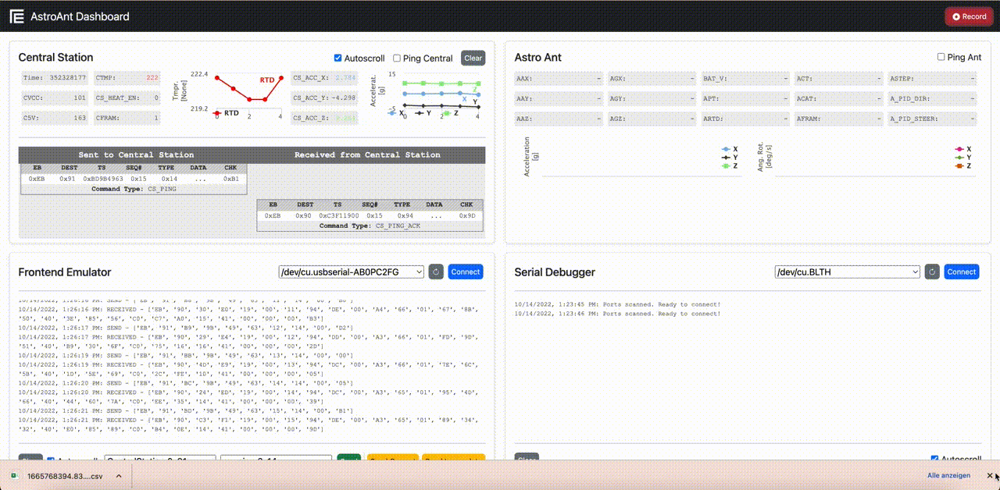

# AstroAnt Dashboard
Python program that acts as frontend, controlled from your browser. Connects to central via RSS422 and sends/receives commands.

## Setup and dependencies
The dashboard requires installing [Python3](https://realpython.com/installing-python/) and pip3. Make sure they are installed on your machine and available as commands from the command line. The dashboard was implemented on macOS and has not been tested on Windows or Linux (issues may occur).

To install the required dependencies of the project run the following command in the `AstroAnt_Dashboard` folder:
```bash
pip3 install -r requirements.txt
```
*Note: Depending on how you installed pip3, change "pip3" to "pip". You can always check the version of pip by running `pip3 -v` or `pip -v`*

## Running the dashboard
To run the dashboard, navigate to the `AstroAnt_Dashboard` folder from your command line. Then run:
```bash
python3 server.py
```
*Note: Depending on how you installed python3, change "python3" to just "python". You can always check the version of python by running `python3 --version` or `python --version`*

You can now open the dashboard in your browser (latest version of Chrome recommended) by navigating to:
```bash
http://localhost:8000
```


## How to use?
The following sections describe how to use the different features of the dashboard. Please not: the dashboard is programmed to run on macOS only!

### Connecting to the central
To connect to the central, go to the bottom left panel. From the dropwdown list, select the port on which the RSS422 is plugged in. You can refresh the list of ports by clicking the reload arrow button. To connect to the central, click connect. A message will be printed, indicating that you have connected successfully.


### Sending commands
To send commands to the central station, navigate to the bottom left panel. From the dropdown list, you can select the desired command. Click "Send", to send the command to the central station. The command will appear in the top left panel. Any response returned by the Central or AstroAnt will be added to the list of commands in the top left panel. For easier interpretation, the dashboard prints every command (sent or received) with a human-readable string under it, indicating the command according to the conops.


### Automated ping
To continiously send ping commands to the central or AstroAnt, the ping checkbox can be activated in the top left (central) and top right (AstroAnt) panel. After checking this box, ping commands will be sent continiously. Note: The central and/or AstroAnt have to be connected first to get responses to the ping command. Follow the conops to learn how to connect to the AstroAnt via the central using the intended commands (Hint: Sending the garage open command will trigger the central to start looking for the AstroAnt. Once the AstroAnt has connected, a connect ACK command will be returned from the central to the frontend. The AstroAnt will now be ready to receive commands from the frontend via the central.) After you ping the central or AstroAnt the response will be shown on their respective panels.


### Recording
To record data, the "Record" button in the top right corner can be used. Activating the recording stores all commands (sent or received) by writing them to a file in real time. After stopping the recording, the list of commands will be downloaded automatically as CSV file.



### Sending commands to the AstroAnt
After connecting the AstroAnt to the central (see "Automated ping"), commands can be sent directly to the AstroAnt via the central. From the bottom left panel, got to the bottom left dropdown menu and select the AstroAnt. The dropdown list next to it will now show the commands available for the AstroAnt. Select the desired command and send them using the "Send" button.


